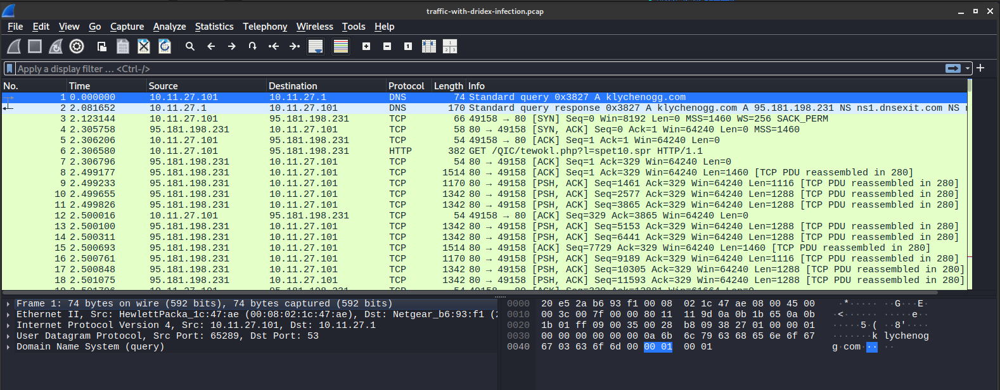

# Analysis

Tools used: WireShark, Virustotal

## 1. Initial Inspection

- **Step 1:** Open the `.pcap` file in Wireshark.

- **Step 2:** Note **name, total packets, capture duration, file size, and timestamps** (`Statistics → Capture File Properties`).

### **2. Protocol Overview**

- **Step 1:** Navigate to `Statistics → Protocol Hierarchy`.

Identify the types of protocols used like TCP, HTTP, DNS, SMD, ICMP. Most attack can happen using these protocols.

In our case we start with HTTP protocol.

### **3. Conversation and Endpoint Analysis**

- **Step 1:** Go to `Statistics → Conversations` and review:
    - **IPv4/IPv6 conversations** – identifies communication between IP pairs.
    - **Bytes transferred, packets count, duration.**

- **Step 2:** Go to `Statistics → Endpoints` to identify:
    - **Top talkers** (highest data senders/receivers)
    - **External IPs** communicating with internal hosts.

<aside>
💡

We can start investigation from most traffic flow IPs and packets from conversations and endpoints panel.

</aside>

## 4. Filtering and Deep Packet Inspection

Apply display filters to isolate key traffic:

- **HTTP:** `http`

Inspect packets with GET requests and use Follow HTTP stream.

`spet10.spr`, `oiioiashdqbwe.rar` files and `klychenogg[.]com` domain are suspicious.

After downloading the rar file this the IP used to send post exploitation payload.

- **IP:** `ip.addr == 185.244.150.230`

## 5.Checking if the IPs and Domains are malicious

Tools used: VirusTotal

- klychenogg[.]com Domain is flagged malicious by 11 vendors

- 185.244.150.230 if flagged malicious by 1 vendor

